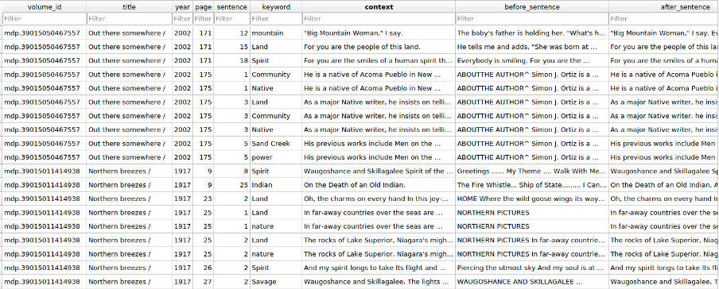

# Final Report: Mining the Native American Authored Works in HathiTrust for Insights

## Introduction
Native Americans represent a historically under-resourced textual community. While there has been an ever-increasing number of Native authors creating works since the 1960s, no corpus of Native-authored works exists from which to draw insights about this particular community, and give them the recognition equal to other similar communities of practice (e.g. History of Black Writing[^1]). In collaboration with the HathiTrust Research Center (HTRC) and with the support of a Scholar-Curated Worksets for Analysis, Re-use and Dissemination grant (SCWAReD[^2]), we have created a preliminary database of Native-authored works, which allows us to use text mining techniques to reveal novel characteristics of this community, such as their identity, worldview, representation, and modes of expression. Text mining also offers a new approach to looking at the ways in which Native authors express themselves and how they may differ from other authors. For example, there is a common assertion that Native peoples forefront the natural world or communitarian relationships more so than non-Native authors (e.g. Schweninger 1993, Weaver 1997). Additionally, we are interested in the rhetorical characteristics of the Native American Studies academic genre as illustrated by corpora of Native Studies journals, and how these trends define the evolution of the discipline over time.

This report documents the work of our interdisciplinary team in developing a database of Native-authored texts, creating a Naitve-authored workset in HathiTrust, and applying a variety of text mining methods to the content of the Native-authored works versus a baseline corpus of non-Native-authored works on similar subjects and during a similar timeframe. The database and worksets created for this project will be reusable by scholars and stakeholders who are interested in Native American perspectives and the unique and valuable contributions of these authors.

## Research Questions
The project sets out to address the following research questions:
1. How well are Native authors represented in HathiTrust? What groups are more or less represented as authors? How much of the work about Native people is by Native people?
2. What are the characteristics of the Native authors and works? How do they change overtime?
3. What are the characteristics of the writing styles of Native authors? How do they compare with non-Native authors when writing on similar subjects?

## Data Collection
### Scope
There is a vast amount of extant literature on Native Americans and Native-related topics, the vast majority of which is not authored by Native people. As an illustration, a HathiTrust records search of “American Indian” subject headings from the US and Canada recovered 35,440 records, more than 17x the size of our dataset (see below). There are also many long-standing issues related to delineating both Native ethnic and tribal affiliation (Garroutte, 2003), which we had to contend with in assembling this database. We chose to include only those authors who self-report being a member of a particular federally recognized tribe. Additionally, while there are Native and Indigenous authors all over the world, we limited our search to authors from and publishing in the continental US and Canada. Finally, since many works (particularly the scholarly works) are co-authored by Native and non-Native people, as well as instances where Native writers have published in a compilation or edited volume, we have included those volumes in our database rather than excluding them.

### Native authors database
There is no mechanism in the metadata from the HathiTrust Digital Library for identifying if an author is Native or non-Native. As such, there is no easy way to collect Native American authored works directly from the collection. To build the list of Native authors for the workset, the OU team began by compiling lists of Native authors and their works from publicly available datasets, locally accessible resources, and their personal knowledge. 

One of the primary sources we used to compile our initial list of authors was the Native American Authors collection provided by the Internet Public Library [https://www.ipl.org/div/natam/](https://www.ipl.org/div/natam/). The site contains information on Native North American authors and bibliographies of their published works. Blakesley Lindsay (2003) wrote a review of the IPL’s Native American Authors collection, claiming that the collection covers “a wealth of online resources dealing with Native American writers,” and that the author list includes “an extensive list of Native American writers, including many lesser-known poets and authors,” although the information available on each author varies (p. 41). At the time of the review, the site listed over 1,200 titles. It has grown in the years since, and our collection includes over 2,000 titles from the IPL. Dr. Lu wrote a Python script to scrape the IPL’s author information along with work titles and tribal affiliations. This resulted in 631 Native authors and 2,017 work titles, where four works are listed without author information and therefore excluded. Additional information about the works, such as publication date and author gender, was collected manually by a student mentee. Students also verified the tribal identification for all authors using publicly available information. 

Another source of information on Native-authored works came from the [The Native American Languages (NAL)](https://samnoblemuseum.ou.edu/collections-and-research/native-american-languages/) collection at the [Sam Noble Museum](https://samnoblemuseum.ou.edu) at OU. The NAL collection is an archival repository for materials in and pertaining to Indigenous languages, with a specialization in the Indigenous languages of the central United States. The collection includes audio and video recordings, manuscripts, books, journals, ephemera and teaching curricula from more than 175 Native North American languages. Materials have been donated to the collection from a variety of individuals and groups, including tribal members and families, linguists and anthropologists, community language projects, teachers and students and other archives. As the curator for NAL, Dr. Heaton was able to export a list of published works from the NAL databases, and then manually screen them for Native authorship and other in-scope criteria. The exported lists from NAL resulted in 122 work titles. Dr. Heaton also contributed a list of Native linguists and students maintained by LSA (Linguistic Society of America) special interest group, which includes 34 dissertation titles.

Dr. Orr compiled a list of Native American authors from two decades of Native American Studies literature by looking at Native American Studies journals published since the year 2000. These lists of Native authors and works were then searched in HathiTrust. 

Additionally, given the gaps in more recent works (see below), a student mentee was hired to add current work from additional authors, compiled mainly by pulling from the CVs of Native academics, as well as investigating other popular sources for new releases. 

The list of authors and works we found has been stored in a relational database that includes the author information, work information, and tribal affiliation(s). Effort has also been made to map the authors; self-reported tribal affiliations to federally recognized tribes and First Nations. The database schema is presented in Figure 1. As of Dec 14th, 2022, the database stores information on 956 Native authors, 2,629 works, and 255 affiliated tribes and First Nations.

_Figure 1: Native authors database schema (The Link field in tables stores the external links to the information sources)._

### Workset building process
#### Native-authored workset
The authors and works found from the IPL website and in the NAL collection were searched in HathiTrust to identify Native works in the HathiTrust digital library. The team converted the above lists of Native authors and works into a searching format that is preferred by HTRC staff. The HTRC staff then used the HathiTrust index to search the authors and works in HathiTrust by algorithm en masse. The search process relied on a tool built specifically for identifying volumes available in the HT digital library based on a provided list of titles/authors. The tool first executes a pre-processing step to clean and normalize the title and author list, and then it searches the published HathiFiles (an up-to-date listing of the entire HT holdings which includes title and author information) for matches for each title/author combination from the list provided. The searching is done via a fuzzy-matching algorithm to allow slight variations in spelling of both the titles and author names. While, in general, the fuzzy-matching process returns the correct matches, there were some false positive matches, especially for works with very short titles (e.g., one-word titles) and common author names. These false positives were manually identified and removed by HTRC staff and the researchers at OU during the results review. OU researchers then manually searched the list of titles/authors that were not matched to HathiFiles in the HT digital library Web interface to identify additional matches that were missed by automated searches due to variations in author names or titles, and/or missing information. For the NAL collection, 37 out of 122 titles were found in HathiTrust, yielding 30.33% coverage. For the IPL dataset, 900 titles out of 2,013 were found, for 44.71% coverage. The journal “American Indian Culture and Research Journal” was also searched and HathiTrust covers the journal from 1974 - 2009.

Table 1 summarizes the coverage of Native-authored works in HathiTrust. The following content will focus on the IPL and NAL datasets since they represent the majority of the matches in HathiTrust.

| Dataset | # of titles searched | # of titles found in HT | Coverage |
| :------ | :------------------- | :---------------------- | :------  | 
| IPL     | 2013                 | 900                     | 44.71%   |
| NAL     | 122                  | 37                      | 30.33%   |
| LSA dissertations | 34         | 0                       | 0%       |

_Table 1: Coverage of Native authored works in HathiTrust._

The IPL workset has 900 titles in HathiTrust by Native authors. This corresponds to 1,061 HathiTrust records, since one title may match multiple records, in instances of different editions or multi-volume works. And one record may also correspond to multiple duplicate volumes in HathiTrust. This results in 1,304 unique items in HathiTrust. The publication dates of these items range from 1826 to 2009. These works are contributed by 358 distinct Native authors. The NAL workset includes 37 titles in HathiTrust by Native authors. One of the titles is “Handbook of North American Indians”, a series which we excluded in the subsequent analysis since it is edited and primarily contributed to by non-Native authors. Table 2 summarizes the statistics of the Native-authored worksets:

|                | # of titles          | # of Hathi records | # of Hathi items | Publication date range | # of Native authors | 
| :------        | :------------------- | :----------------------- | :-------- | :-------- | :-------- | 
| IPL            | 900           | 1061       | 1304 | 1826 to 2009 | 358 |
| NAL            | 36          | 45     | 56 | 1900 to 2006 | 15 |
| Total (after removing overlap) | 919  | 1083  | 1322 | 1826 to 2009 | 369 |
_Table 2: A summary of statistics in the Native-authored worksets._

There is overlap between the NAL and IPL worksets: Out of the 36 matched titles, 45 matched records, and 56 matched items in NAL, 17 titles, 23 records and 27 items are also matched in the IPL workset, respectively. Four of the 15 NAL authors are also included in the IPL workset. The total number of matches after removing overlap is listed in the last row of Table 2.

#### Comparative workset
To understand how the writings of the Native authors compare with those of the non-Native authors on similar subjects and during similar time periods, we worked with HTRC staff to create a comparative workset. This involved searching the HathiTrust digital library for similar subjects (i.e. "Indians of North America", "Indians", "Indian", "Indiens", "Indiens d'Amérique"), during similar time (date range 1826 to 2009). The search resulted in 43921 matches. These matches were filtered by limiting the publication place to North America. Then, a random sample of 1000 works was conducted to proportionally sample comparative works based on the proportion of records in decades in the Native workset. This ensures the distributions of works over decades are similar in both worksets. After that, OU researchers adjusted the sample to ensure the language representation is comparable. We also manually screened the remaining works in the comparative workset to ensure no Native authors are in the comparative workset. The process created a comparative workset with 927 volumes.   

## Representation Analysis 
### HathiTrust coverage
Table 1 shows there is 30% to over 40% coverage of Native-authored works in HathiTrust based on the sample we searched. For the works that are covered in HathiTrust, we can see from Figure 2 that Native authorship was very limited prior to 1960.

_Figure 2: Publication year of Native-authored works in HathiTrust._

### Native authors database coverage
The Native authors database covers 2629 Native authored works. This is only a very small percentage of works about Native peoples when considering HathiTrust covers 43,921 works on the “American Indian” subject (using subject terms "Indians of North America", "Indians", "Indian", "Indiens", "Indiens d'Amérique"). This provides a statistic for the pervading perception that the vast majority of works about Native peoples are not written by Native peoples.

_Figure 3: Percentage of Native authors on the “American Indian” subject._

### Tribal representation
To date, our Native authors database covers 255 federally recognized tribes and First Nations. This is only 14.6% out of all recognized Native Nations and First Nations in the U.S. and Canada (Figure 4). The result could be due to the coverage of our database, but is likely indicative of a lack of representation for most tribes with respect to authorship in genres covered by HathiTrust.

_Figure 4: Tribal representation of the Native authors database._

Figure 5 shows the representation in terms of the number of authors from the 10 best represented tribes. This includes many of the most populous tribes,such as Cherokee Nation, Cree/Chippewa/Ojibwe/Anishinaabe, and Navajo Nation. This matches with expectations with respect to population sampling, but shows that representation of tribal nations is not equal.

_Figure 5: Proportion of authors from top 10 tribes._

### Gender representation
Out of the 956 authors in our database, 452 are female, 486 are male, 4 reported two spirit and 14 we do not have information on their gender. There seems to be roughly equal representation of male and female authors in our database.

_Figure 6: Gender representation of Native authors in our database._

## Text Mining Analysis
The project collected term frequency data from HT extracted features and full-text data via the Data Capsules service of HTRC Analytics for the Native-authored workset and comparative workset. Then, text mining analyses were carried out on the Native-authored workset and comparative workset.

### Topic modeling
LDA topic modeling (Blei, Ng, & Jordan, 2003) was used to explore the topics/themes of the corpora. The topic modeling analysis involves converting the text to the bag-of-word representation and using the Gensim open-source library (Rehurek & Sojka, 2011) for unsupervised topic modeling analysis. During the pre-processing, a standard list of English stop words were removed. In addition, the stop word list includes extra tokens that do not carry any meaning, such as “’re”, “‘ve”, “‘ll”, “-lcb”, “-rcb-”, “-lrb”, “-rrb-”, “-lsb-”, “-rsb” etc. All word tokens were normalized to lower case, and stemmed using the snowball stemmer. Numbers and punctuations were removed, as well as words with fewer than three letters. A range of topics from 10 to 100 are generated from the dataset. Major themes are summarized by the domain experts on the team from the list of terms in each topic provided by the topic modeling. Some topics from the topic modeling results do not form coherent themes, and therefore are disregarded. From the topic modeling analysis, we found common themes between the Native-authored workset and comparative workset, including:
- Colonial govt. - tribe relations
- Linguistics
- Industry
- Native arts and subsistence
- Ceremony, kinship

However, we also found notable differences from the topics in the two worksets, including:
- More culture and tradition in the Native set; close association between culture, medicine, community, and government
- Archaeology and history/militarism in the comparative workset
- Casinos/gaming, health, boarding schools, and student/education-related topics in the comparative workset

The topic model analysis offers a broad overview of the themes in both worksets.

### Keyword in context
Based on the initial exploration in topic modeling analysis, the domain experts on the team compiled a list of terms that are of interest of Native American Studies. The terms are from categories of:
- People/groups (e.g. Vine Deloria, Sitting Bull, Quanah Parker, Custer, Black Kettle, AIM etc.)
- Events/places (e.g. Sand Creek, Trail of Tears, Wounded Knee, Black Hills, Alcatraz, NAGPRA etc.)
- Academic terms (e.g. Relationality, Reciprocity, Survivance, Decolonize, Sovereignty, Revitalization etc.)
- Archaeology terms (e.g. prehistory, Mississippian, artifact, excavate, ancient etc.)
- People terms (e.g. Indian, Whites, savage, Indigenous, colonist, blood quantum etc.)
- Misc. relevant things (e.g. land, massacre vs. battle, frontier, New World, per cap, assimilate etc.)

A python script was written to search the occurrences of these terms in the volumes of the worksets. The information we collected includes: volume id, title, publication year, page number, sentence number, keyword, the sentence where the keyword occurs, five sentences before this sentence, and five sentences after this sentence. An example of the keyword in context data is provided in Figure 7:

_Figure 7: Example of keywords in context data._

The keywords in context data also allows us to calculate term frequencies based on their occurrences in text. To compare the term usage by Native authors and non-Native authors, we calculated the percentage of works using the keywords over different decades. This measure normalizes the raw term frequency counts by the total number of works per decade. Figure 8 provides an example of the term usage data and how it is calculated:

_Figure 8: Term usage calculation. The “Works” column shows the number of works mentioned this term in that decade. The “Totals” column shows the total number of works in that decade in the workset. The percentage is used in the analysis._

#### Term usage results
The term usage analysis revealed that most terms we were interested in did not show up until the 1960s (Figure 9). 

_Figure 9: Term usage over time._

The most frequent terms like “land”, “water”, “rights”, “power”, “spirit(ual)(ity)” were frequently used in both Native-authored workset and comparative workset (Figure 10).

_Figure 10: Nature terms were frequently used in both worksets. (Left picture shows the term usage in the Native-authored workset, right picture shows the term usage in the comparative workset)._

“Indian” is the most widely used term by both worksets for all years, followed by ‘Native’. ‘Indignous’ is surprisingly uncommon, and ‘Aboriginal’ is used significantly more often in the comparative workset with a non-parametric Wilcoxon signed-rank test.

_Figure 11: Group terms usage between the worksets (Left picture shows the term usage of the Native-authored workset, and right picture shows the term usage of the comparative workset)._

Figure 12 shows that most academic terms have not gained much traction for either set of authors, except for “community” which is a popular term in both sets.

_Figure 12: Academic terms usage between the worksets (Left picture shows the term usage of the Native-authored workset, and right picture shows the term usage of the comparative workset)._

We have also found surprisingly infrequent mentions of historical figures (e.g. Geronimo, Custer, Sequoyah, etc.), contemporary figures and movements (e.g. Deloria, AIM, BIA, etc.), legislation (e.g. Indian Removal Act, Allotment, Trail of Tears, etc.), conflicts (Wounded Knee, Little Big Horn, etc.) in both worksets.

#### Context analysis
The term usage analysis revealed statistically significant differences between the two worksets in their usage of “New World”, “extinct”, “settler”, “frontier”, and “pioneer.” The domain experts on the team manually examined the context in which these terms occur in both worksets. This manual examination also found some spurious mentions of these terms that are different from the meaning we were targeting. These spurious mentions were removed manually.

The context analysis is still a work in progress. Initial observations suggest that both corpora are quite similar in most ways, however, authors from the comparative workset are more likely to use these terms uncritically, while Native authors are generally critical of and sometimes play off these concepts.

Below is a list of quotes from the Native-authored workset and comparative workset in their usage of these terms:

##### Examples of “extinct”:
Comparative workset:

    “Early extinction resulted from their small initial population and the effects of Franciscan activities in three missions close to Esselen territory.”

Native-authored workset:

    “Tribes got together throughout the nation and informed the government and public we were not extinct, dead, or gone; our ancestors had a right to come home, not be in the Smithsonian Institution, and not be dissected by science.
    “Their names were Moe and Curly, and all three brothers were members of a nearly extinct tribe called WASP liberals.”
We have plans to investigate these sorts of differences further using sentiment analysis. 

### Word embedding
Another text mining analysis we carried out on the two worksets is word embedding (Mikolov, et al., 2013). Word embedding models use unsupervised learning to train vector representations of words that are useful to measure semantic similarities. Both continuous Bag-of-Words model and continuous skip-gram model were trained on Native-authored workset and comparative workset independently. A phrase mining algorithm was applied to detect phrases in the corpora before the training so that phrases can be queried (Shang, et al., 2018). The resulting vector representations of the terms and phrases can be used to measure semantic similarities. A [colab notebook](https://colab.research.google.com/drive/1oce0YBo2gho_DU5QnkPCqvqVlc_ct6qy#scrollTo=NdBW4XDajThq) was developed to support inquiries of term similarities based on trained word embedding. Figure 13 shows an example of running term similarity inquiries from the Native-authored workset and Figure 14 shows the same term inquiry but on the comparative workset. The notebook allows real-time inquiries of phrases/terms of interest.

_Figure 13: Most similar terms to “trail of tears” based on word embedding model trained on the Native-authored workset._

_Figure 14: Most similar terms to “trail of tears” based on word embedding model trained on the comparative workset._

## Summary
This project pioneers the exploration of text mining methods for the Native American Studies field, and generates a reusable database and worksets for future studies that are interested in exploring Native-authored works. A few take-aways from this project:
- Although Native Studies rarely foregrounds quantitative techniques, we see here that Digital Humanities quantitative techniques confirm at least some of the things we know about Native writing.
- Computer-generated methods are incredibly helpful for handling larger datasets. However, manual screening is still always necessary to get accurate results. 
  - Cleaning HathiTrust author lists
  - Cleaning Keyword in Context results
  - Standardizing data (tribal affiliation, language ID)
  - Adding missing information (e.g. chapter vs. edited volume)

We hope this project inspires future projects to continue exploring DH techniques for the Native American Studies field. We envision a future of increased use of DH methodologies for the Native American Studies field.

## References
Blakesley Lindsay, E. (2003). Native American Authors. Reference Reviews, 17(5), 41-42.

Blei, D. M., Ng, A. Y., & Jordan, M. I. (2003). Latent dirichlet allocation. Journal of machine Learning research, 3(Jan), 993-1022.

Garroutte, Eva. (2003). Real Indians: Identity and the Survival of Native America. Berkeley, CA: The University of California Press. 

Greenfield, Patricia, M. (2013). The Changing Psychology of Culture From 1800 Through 2000. Psychological Science, DOI: 10.1177/0956797613479387.

Mikolov, T., Chen, K., Corrado, G., & Dean, J. (2013). Efficient estimation of word representations in vector space. arXiv preprint arXiv:1301.3781.

Schweninger, L. (1993). Writing Nature: Silko and Native Americans as Nature Writers. Melus, 18(2), 47-60.

Shang, J., Liu, J., Jiang, M., Ren, X., Voss, C. R., & Han, J. (2018). Automated phrase mining from massive text corpora. IEEE Transactions on Knowledge and Data Engineering, 30(10), 1825-1837.

Rehurek, R., & Sojka, P. (2011). Gensim–python framework for vector space modelling. NLP Centre, Faculty of Informatics, Masaryk University, Brno, Czech Republic, 3(2).

Weaver, J. (1997). ​​That the people might live: Native American literatures and Native American community. Oxford University Press. 

-----
[^1]: https://hbw.ku.edu/ 
[^2]: https://go.illinois.edu/HTRC_SCWAReD 
