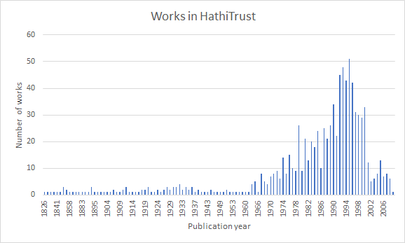
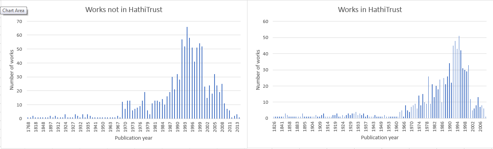
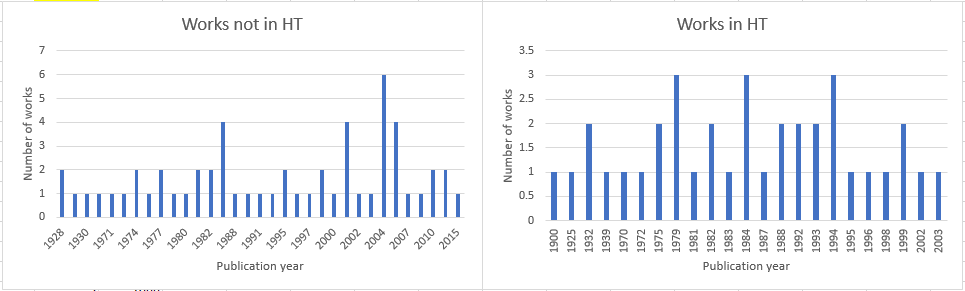

# Introduction to Native-Authored Workset

The University of Oklahoma (OU) team was funded by the Mellon
Foundation, through the HathiTrust Research Center’s SCWAReD project, to
create a workset by Native American authors in the HathiTrust digital
library. This document serves as an introduction to the workset,
describing the workset building process, the content of the workset, the
context of the works, and some example research questions that can be
answered using this workset.

## Rationale for the Project

Native Americans are a historically under-resourced textual community.
No corpus of Native-authored works exists from which to draw insights
about this particular community, or to give them the recognition equal
to other similar communities of practice (e.g. History of Black
Writing<a id="ref01"/>[\[1\]](#note01)), despite an ever-increasing number of Native authors
creating works since the 1960s. In collaboration with the HathiTrust
Research Center (HTRC) team, we have created a preliminary database of
Native-authored works, of which a subset has been identified as being
held in the HathiTrust Digital Library. This workset is now available to
all researchers with an interest in Native-authored literature, and we
hope that it will serve as a basis for more qualitative and quantitative
research that speaks to the unique characteristics of this textual
community.

## Building Process

### Team

The team at OU consists of Dr. Raina Heaton and Dr. Raymond Orr (now at
Dartmouth College) from the Department of Native American Studies, and
Dr. Kun Lu, from the School of Library and Information Studies. The team
also supervises a student mentee, Alyssa Vetter, a biology major with a
minor in Native American Studies. The OU team works closely with HTRC
staff including Ryan Dubnicek, Isabella Magni and PhD student Nikolaus
Parulian.

Scope

There is a vast amount of extant literature on Native Americans and
Native-related topics, the vast majority of which is not authored by
Native people. As an illustration, a HathiTrust records search of
“American Indian” subject headings from the US, Canada, and Mexico
recovered 35,440 records, more than 17x the size of our dataset (see
below). There are also many long-standing issues related to establishing
both native ethnic and tribal affiliation (Garroutte, 2003), which we
had to contend with in assembling this database. Additionally, while
there are Native and Indigenous authors all over the world, we limited
our search to authors from and publishing in the continental US and
Canada. Additionally, since many works (particularly the scholarly
works) are co-authored by Native and non-Native people, or are instances
where Native writers have published in a compilation or edited volume,
we have included those volumes in our database rather than exclude them.

### Compiling lists of Native authors and works

There is no mechanism in the metadata from the HathiTrust Digital
Library for identifying if an author is Native or non-Native. As such,
there is no easy way to collect Native American authored works in the
collection. To build the list of Native authors for the workset, the OU
team began by compiling lists of Native authors and their works from
publicly available datasets, locally accessible resources, and their
personal knowledge.

One of the primary sources we used to compile our initial list of
authors was the Native American Authors collection provided by the
Internet Public Library
([https://www.ipl.org/div/natam/](https://www.ipl.org/div/natam/)).
The site contains information on Native North American authors and
bibliographies of their published works. Blakesley Lindsay (2003) wrote
a review of the IPL’s Native American Authors collection, claiming that
the collection covers “a wealth of online resources dealing with Native
American writers,” and that the author list includes “an extensive list
of Native American writers, including many lesser-known poets and
authors,” although the information available on each author varies (p.
41). At the time of the review, the site listed over 1,200 titles. It
has grown in the years since, and our collection includes over 2,000
titles from IPL. Dr. Lu wrote a Python script to scrape the IPL’s author
information along with work titles and tribal affiliation. This resulted
in 631 Native authors and 2017 work titles where four works are listed
without author information, and therefore excluded. Additional
information about the works, such as publication date and author gender,
was collected manually by a student mentee.

Another source of information on Native-authored works came from the
[The Native American Languages
(NAL)](https://samnoblemuseum.ou.edu/collections-and-research/native-american-languages/)
collection at the [Sam Noble
Museum](https://samnoblemuseum.ou.edu) at OU. The NAL collection
is an archival repository for materials in and pertaining to Indigenous
languages, with a specialization in the Indigenous languages of the
central United States. The collection includes audio and video
recordings, manuscripts, books, journals, ephemera and teaching
curricula from more than 175 Native North American languages. Materials
have been donated to the collection from a variety of individuals and
groups, including tribal members and families, linguists and
anthropologists, community language projects, teachers and students and
other archives. As the curator for NAL, Dr. Heaton was able to export a
list of published works from the NAL databases, and then manually screen
them for Native authorship and other in-scope criteria. The exported
lists from NAL resulted in 122 work titles. Dr. Heaton also contributed
a list of Native linguists and students maintained by LSA (Linguistic
Society of America) special interest group, which includes 34
dissertation titles.

Dr. Orr compiled a list of Native American authors from two decades of
Native American Studies literature by looking at Native American Studies
journals published since the year 2000. These lists of Native authors
and works were then searched in HathiTrust to identify the Native
authored workset.

### Searching Native authors and works in HathiTrust

The OU team converted the above lists of Native authors and works into a
searching format that is preferred by HTRC staff. The HTRC staff then
used the HathiTrust index to search the authors and works in HathiTrust
by algorithm *en masse*. The search process relied on a tool built
specifically for identifying volumes available in the HT digital library
based on a provided list of titles/authors. The tool first executes a
pre-processing step to clean and normalize the title and author list,
and then it searches the published
[HathiFiles](https://www.hathitrust.org/hathifiles)
(an up-to-date listing of the entire HT holdings which includes title
and author information) for matches for each title/author combination
from the list provided. The searching is done via a fuzzy-matching
algorithm to allow slight variations in spelling of both the titles and
author names. While, in general, the fuzzy-matching process returns the
correct matches, there are situations where false positive matches are
identified, especially for works with very short titles (e.g., one-word
titles) and common author names. These false positives were identified
and removed by HTRC staff and the researchers at OU during the results
review.

OU researchers then manually searched the list of titles/authors that
were not matched to HathiFiles in the HT digital library Web interface
to identify additional matches that were missed by automated searches
due to variations in author names or titles, and/or missing information.
For the NAL collection, 37 out of 122 titles were found in HathiTrust,
accounting for a 30.33% coverage. For the IPL dataset, 900 titles out of
2013 were found, accounting for a 44.71% coverage. Table 1 summarizes
the coverage of Native-authored works in HathiTrust. The following
content will focus on the IPL and NAL datasets since they represent the
majority of the matches in HathiTrust.

Table 1: Coverage of Native authored works in HathiTrust

| **Dataset**       | **\# of titles searched** | **\# of titles found in HT** | **Coverage** |
| ----------------- | ------------------------- | ---------------------------- | ------------ |
| IPL               | 2013                      | 900                          | 44.71%       |
| NAL               | 122                       | 37                           | 30.33%       |
| LSA dissertations | 34                        | 0                            | 0%           |

## Content of the Workset

### IPL workset

The IPL workset has 900 titles in HathiTrust by Native authors. This
corresponds to 1,061 HathiTrust records, since one title may match
multiple records, in instances of different editions or multi-volume
works. And one record may also correspond to multiple duplicate volumes
in HathiTrust. This results in 1,304 unique items in HathiTrust. The
publication dates of these items range from 1826 to 2009. These works
are contributed by 358 distinct Native authors. Figure 1 shows the
distribution of works over years.

  
_Figure 1. Number of works over years in the IPL workset._

### NAL workset

The NAL workset includes 37 titles in HathiTrust by Native authors. One
of the titles is “Handbook of North American Indians”, a series which we
excluded in the subsequent analysis. The remaining 36 titles correspond
to 45 HathiTrust records and 56 HathiTrust items. The publication dates
range from 1900 to 2006. These works are contributed by 15 Native
authors.

Native-authored workset summary

The following table summarizes the basic statistics of the worksets.

Table 2: A summary of statistics in the Native-authored worksets.

|                                | \# of titles | \# of Hathi records | \# of Hathi items | Publication date range | \# of Native authors |
| ------------------------------ | ------------ | ------------------- | ----------------- | ---------------------- | -------------------- |
| IPL                            | 900          | 1061                | 1304              | 1826 to 2009           | 358                  |
| NAL                            | 36           | 45                  | 56                | 1900 to 2006           | 15                   |
| Total (after removing overlap) | 919          | 1083                | 1322              | 1826 to 2009           | 369                  |

There is overlap between the NAL and IPL worksets: Out of the 36 matched
titles, 45 matched records, and 56 matched items in NAL, 17 titles, 23
records and 27 items are also matched in the IPL workset, respectively.
Four of the 15 NAL authors are also included in the IPL workset. The
total number of matches after removing overlap is listed in the last row
of Table 2.

## Gap Analysis

This section compares what is included in HathiTrust and what is not
among the titles that have been searched in this project.

### IPL dataset

#### Publication dates

Out of 2,013 titles in the IPL dataset that were searched in HathiTrust,
900 titles were found and 1,113 titles were not. The distribution of
works by year of publication is shown below, excluding 33 titles for
which we do not have publication dates:

  
_Figure 2. Comparison of publication dates on IPL dataset._

The date range of the missing works is wider than that of the included
works, ranging from 1768 to 2013, but the distributions for included and
missing works look similar. Some older (before 1826) or newer (after
2009) are not found in HathiTrust. Both sets show a gradual increase in
the number of works beginning in the mid-1960s, reaching a peak from
1990 to 2000, and gradually declining after 2000. This trend could be
due to the coverage of the IPL dataset rather than that of the
HathiTrust. However, the number of titles covered in HathiTrust after
2000 is much smaller than that not covered in HathiTrust (66 v.s. 211).
*This suggests that HathiTrust may have a lower
coverage of some more recent Native-authored works in IPL.*

It is important to add that there has been a continual increase in
publications by Native people since the early 2000s. Given that it is
now 2022, the fact that our data sources do not include many more
contemporary works is a limiting factor for analyses seeking to use this
dataset.

#### Tribal representation

Comparable levels of tribal representation are observed in the included
and missing works in HathiTrust: 135 tribes are represented in works
included in HathiTrust and 149 tribes represented in works not included.
There are 112 tribes represented in both sets, 23 tribes in works only
included in HathiTrust, and 37 tribes represented only in works missing
from HathiTrust.

#### Author gender representation

For those authors for whom we have gender information, the works
included in HathiTrust are authored by 153 female authors and 198 male
authors, while the works not included are authored by 184 female authors
and 275 male authors. The percentage of female authors is 43.6% for
works included in HathiTrust and 40.1% for works not in HathiTrust.

### NAL dataset

For the NAL dataset, 103 titles were searched and 36 were found in
HathiTrust. The coverage in HathiTrust of Native languages and related
topics by Native authors is lower than that for IPL, which is a more
general literature list. The following analysis compares the NAL works
that are included in HathiTrust with those that are not. It should be
noted that the NAL collection size is much smaller than that of the IPL.

#### Publication dates

The publication dates of the 36 titles found in HathiTrust range from
1900 to 2003, compared with 1928 to 2015 for those titles not included
in HathiTrust. No clear trend is observed from this dataset due to the
small sample size. However, in terms of coverage of more recent works,
only two titles after 2000 are included in HathiTrust compared with 23
titles not included from the same period of time.
*The coverage of some more recent titles is
lower in HathiTrust, which is consistent with what is observed in the
IPL dataset.* Interestingly, HathiTrust includes some old titles
that were published before 1928.

  
_Figure 3. Comparison of publication dates on NAL dataset._

#### Tribal representation

For the authors for whom we know their tribal affiliations, we analyzed
the tribal representation of the NAL works covered by HathiTrust versus
not covered by HathiTrust. Eleven tribes are represented in works found
in HathiTrust, compared with 25 tribes for works not found in
HathiTrust. There are two tribes only represented by the works in
HathiTrust: Kiowa and Gwich’in, and 16 tribes represented only by the
works not in HathiTrust. *It appears that the
tribal representation is not as wide in HathiTrust for Native-authored
works on and about Native languages.*

#### Author gender representation

For the authors for whom we have gender information, we compared the
gender representation of works in HathiTrust versus works not in
HathiTrust for the NAL dataset. For the works in HathiTrust, there are
six female authors and eight male authors, compared with 34 female
authors and 21 male authors of works not in HathiTrust. The percentage
of female authors is 42.86% for works covered in HathiTrust and 61.82%
for works not in HathiTrust. This result may not be conclusive due to
the small sample size of the NAL collection.

## Example Research Questions

Following is a list of potential research questions that might be
explored using the Native-Authored Workset described above.

1. What role do we see nature playing in Native-authored works, and
   in what forms? Terms: nature, mountain, water (type of water), and
   maybe proximity to terms of respect or belonging.

2. What about the use of the collective versus individualistic terms
   outlined by work by Greenfield, 2013 found as the 20th century
   progressed, there are more “I”s than “we”s in the literature, as
   well as a greater use of terms denoting entitlement as compared to
   obligation)? Can we test the assumption that authors might use
   more collective rather than individual descriptions?

3. What types of works do we see?

4. What words for power or authority might be used? Sovereignty is a
   major topic in the field, but how is it used in the published
   written record? When talking about non-Natives, what is the
   context? In the 1970s-1980s when one saw the term “white man,”
   what was the surrounding text? How about settler or colonist or
   invader?

5. One common assumption is that Native-authored literature might
   deal with or address loss and trauma. Do we see terms that might
   indicate this in these works?

6. When an author of X tribe writes, does he/she talk about other
   tribes? How tribally specific or focused are authors? How often do
   they mention a specific tribe as opposed to “Native American,”
   “American Indian,” or more general terms?

7. What major places or events are discussed, and how? E.g., Wounded
   Knee, Alcatraz, Sand Creek. Same for major figures such as Sitting
   Bull, Dennis Banks, Pocahontas – but also non-Native peoples.

8. What groups are more/less represented as authors? As topics? Is
   any region more represented than another?

9. Is there an asymmetry in male vs. female Native authors?

10. Graph the (presumed) increase in production of scholarship by
   Native authors over time.

11. What Native languages are more/less represented as language of
    composition? As a topic?

12. To what extent are Native languages (or words) used in primarily
    English-language works? In what contexts?

13. Are there any examples of Native people publishing on Native
    languages that aren’t theirs?

14. Investigating discussions around “community”

15. Appearance of terms like “extinct”, “endangered”, “loss”,
    “obsolescence” vs. “dormant”, “awakening”, “revitalization”,
    “preservation”, “resilience”

16. Comparative lexical frequency analysis between our workset and the
    control. If we can do just general, that’s an option, or we can
    come up with relevant terms. Just trying to catch some things we
    may not have thought of.

## References

Blakesley Lindsay, E. (2003). Native American Authors. *Reference Reviews, 17*(5), 41-42.

Garroutte, Eva. (2003). *Real Indians: Identity and the Survival of Native America*. Berkeley, CA: The University of California Press.

Greenfield, Patricia, M. (2013). The Changing Psychology of Culture From 1800 Through 2000. *Psychological Science*, DOI:
[10.1177/0956797613479387](http://dx.doi.org/10.1177/0956797613479387)

---

<a id="note01"/>\[[1](#ref01)] <https://hbw.ku.edu/>
